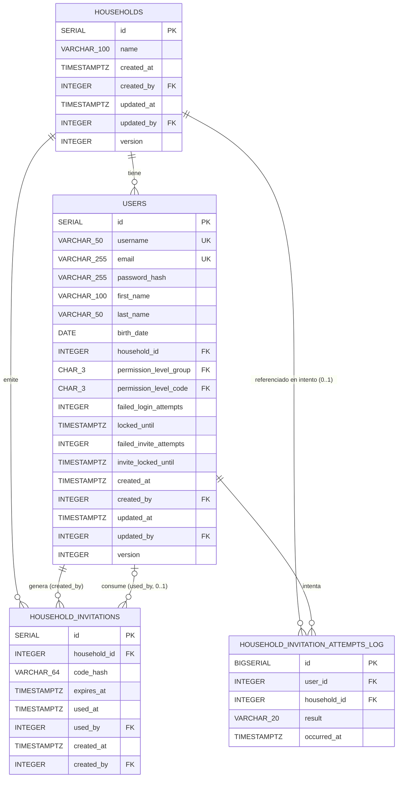

# Data Model: 002-user-registration-households

> Reflejo local, orientado a implementación, del modelo canónico en
> `.specify/memory/data-model.md` (entidades introducidas en esta feature: `household_invitations`,
> `household_invitation_attempts_log`; entidad modificada: `users`, con dos columnas nuevas). Ante
> cualquier discrepancia, el canónico es la fuente de verdad — este fichero se actualiza para
> reflejarlo, nunca al revés.
>
> Esquema diseñado y aprobado vía `db-designer` siguiendo `.claude/context/04_base_datos.md` y el
> protocolo de `.specify/memory/schema-change-protocol.md` (impacto sobre `users`, tabla de la que
> depende `001-login-skeleton`, evaluado y presentado al humano antes de aplicarse — ver changelog
> del canónico). No reutiliza ningún borrador de `.specify/memory/db_ideas.md`: el prompt de
> `/speckit.plan` de esta feature no lo referenció.

## Diagrama

## Entidades

### `households` (sin cambios de esquema — primera gestión real)

Ya existente desde 001 (solo como FK nullable desde `users`, sin flujo propio). Esta feature añade
su primer uso real: creación por un usuario (FR-005) y FK entrante desde `household_invitations`. No
se modifica ninguna columna.

| Columna | Tipo | Constraints |
|---|---|---|
| id | SERIAL | PK |
| name | VARCHAR(100) | NOT NULL — no único (FR-014): hogares distintos pueden compartir nombre |
| created_at / created_by / updated_at / updated_by / version | — | auditoría estándar completa |

### `users` (modificada — 2 columnas nuevas)

| Columna | Tipo | Constraints | Notas |
|---|---|---|---|
| id | SERIAL | PK | 001 |
| username / email / password_hash / first_name / last_name / birth_date | — | sin cambios | 001 |
| household_id | INTEGER | NULL, FK → `households(id)` | 001; primer uso real en esta feature (FR-005/FR-006) |
| permission_level_group / permission_level_code | — | sin cambios | 001; primer uso real: `ADM` al crear hogar, `MEM` al asociarse (FR-005/FR-006) |
| failed_login_attempts / locked_until | — | sin cambios | 001 |
| **failed_invite_attempts** | **INTEGER** | **NOT NULL DEFAULT 0** | **002, FR-013** |
| **invite_locked_until** | **TIMESTAMPTZ** | **NULL** | **002, FR-013; NULL = sin bloqueo activo** |
| created_at / created_by / updated_at / updated_by / version | — | sin cambios | 001 |

**Reglas de negocio de `failed_invite_attempts`/`invite_locked_until`** (implementadas en código de
aplicación, no en el esquema — mismo patrón que `auth/lockout.py` de 001):
- Al fallar la introducción de un código: `failed_invite_attempts += 1`; si llega a 5, fijar
  `invite_locked_until = now() + 15min`.
- Al expirar `invite_locked_until` (`invite_locked_until < now()`): resetear
  `failed_invite_attempts = 0` automáticamente en el siguiente intento, sin requerir un código
  correcto previo (FR-013).
- Al asociarse correctamente a un hogar: `failed_invite_attempts = 0`, `invite_locked_until = NULL`.

**Impacto sobre `001-login-skeleton`** (protocolo de cambio de esquema, paso 3 — `users` es una
tabla de la que depende 001): migración puramente aditiva (`ALTER TABLE ... ADD COLUMN` con
`DEFAULT` seguro), sin modificar ninguna columna, constraint, índice ni comportamiento ya
documentado en `specs/001-login-skeleton/`. El flujo de login de 001 no lee ni escribe estas
columnas nuevas. **Requiere UAT humana** antes de aplicar la migración en cualquier entorno con
datos de usuario ya existentes (regla de `.claude/context/01_estilo_comportamiento.md`: toda
migración sobre datos ya existentes en producción requiere UAT explícita) — no es un requisito de
correctness, es la política del proyecto para cualquier `ALTER TABLE` sobre una tabla poblada.

### `household_invitations` (nueva)

Código de invitación de un solo uso para asociarse a un hogar ya existente (FR-006/FR-007).

| Columna | Tipo | Constraints | Notas |
|---|---|---|---|
| id | SERIAL | PK | |
| household_id | INTEGER | NOT NULL, FK → `households(id)` | hogar que emite la invitación |
| code_hash | VARCHAR(64) | NOT NULL | HMAC-SHA256 del código de 8 caracteres, secreto `INVITE_CODE_HMAC_SECRET` — ver ADR-0006 |
| expires_at | TIMESTAMPTZ | NOT NULL | `created_at` + 24h, calculado por la aplicación al generar (FR-006) |
| used_at | TIMESTAMPTZ | NULL | NULL hasta que se usa |
| used_by | INTEGER | NULL, FK → `users(id)` | usuario que consumió el código |
| created_at | TIMESTAMPTZ | NOT NULL DEFAULT now() | |
| created_by | INTEGER | NOT NULL, FK → `users(id)` | miembro del hogar que generó el código (FR-007); NOT NULL porque siempre hay un actor autenticado |

`CHECK ((used_at IS NULL) = (used_by IS NULL))` — consistencia entre ambos campos.

**Por qué HMAC-SHA256 y no Argon2id** (a diferencia de `password_hash`): Argon2id es salteado — el
mismo valor en claro produce un hash distinto en cada llamada, lo que impide `WHERE code_hash = ?`
para localizar la invitación al validar un código introducido (US3). HMAC-SHA256 con secreto de
aplicación es determinista (permite lookup indexado en O(1)) y sigue sin ser reversible ni
almacenar el código en claro, cumpliendo FR-006. Decisión de arquitectura documentada aparte en
`docs/ADR/records/ADR-0006-hash-hmac-codigo-invitacion.md` (Aceptado).

**Sin `updated_at`/`updated_by`/`version`** — desviación deliberada del set de auditoría estándar,
igual que `user_sessions` en 001 pero con razonamiento distinto: la única mutación posible de una
fila en todo su ciclo de vida es la transición de "no usada" a "usada", ya capturada de forma más
precisa por `used_at`/`used_by` que por columnas genéricas (que serían redundantes). No existe
concepto útil de "versión" al haber una única transición de estado posible. La concurrencia en el
consumo del código se resuelve a nivel de aplicación con
`UPDATE household_invitations SET used_at = now(), used_by = :user_id WHERE id = :id AND used_at IS NULL`
(atómico), sin necesitar lock optimista.

**Índices**: `household_id`, `created_by`, `used_by` (FK, obligatorias por convención) y `code_hash`
(B-Tree, justificado por la query de validación de US3:
`WHERE code_hash = ? AND used_at IS NULL AND expires_at > now()`). Sin índice sobre
`expires_at`/`used_at` para una futura purga: volumen esperado bajo (generación de códigos es un
evento poco frecuente por hogar, no un log de alto volumen), un `DELETE` periódico sin índice es un
table scan trivial a esta escala — añadir el índice sería indexar sin query real que lo justifique.

### `household_invitation_attempts_log` (nueva)

Append-only. Un evento por cada intento de introducir un código de invitación (éxito, fallo o
bloqueado), simétrica a `login_audit_log` (001), cubriendo el hueco de auditoría por-intento que el
contador `users.failed_invite_attempts` no registra de forma histórica (FR-012/FR-013). Retención:
90 días, mismo patrón que `login_audit_log` (purga vía job de mantenimiento, fuera del alcance de
código de aplicación de esta feature).

| Columna | Tipo | Constraints | Notas |
|---|---|---|---|
| id | BIGSERIAL | PK | |
| user_id | INTEGER | NOT NULL, FK → `users(id)` | a diferencia de `login_audit_log.user_id` (NULL): US3 exige que quien introduce un código ya esté autenticado, siempre hay un usuario real |
| household_id | INTEGER | NULL, FK → `households(id)` | NULL si el código no corresponde a ninguna invitación existente, o si `result = 'locked'` (el intento se rechaza sin validar el código) |
| result | VARCHAR(20) | NOT NULL, CHECK IN ('success','failure','locked') | |
| occurred_at | TIMESTAMPTZ | NOT NULL DEFAULT now() | índice BRIN (dato secuencial de log, mismo patrón que `login_audit_log`) |

Sin columna para el código intentado (ni en claro ni hasheado) — mismo criterio que
`login_audit_log`, que tampoco guarda la contraseña intentada. Sin
`created_by`/`updated_by`/`version`: fila inmutable de un único `INSERT`, con `user_id` ya como
actor explícito (un `created_by` adicional sería redundante).

**Índices**: `user_id`, `household_id` (FK, obligatorias por convención) y BRIN sobre `occurred_at`
(dato secuencial, más ligero que B-Tree para este patrón de escritura/purga — mismo criterio que
`login_audit_log.occurred_at`).

## Orden de creación (migración Alembic)

1. `household_invitations` (depende de `households` y `users`, ya existentes desde 001 — sin
   problema de FKs cruzadas).
2. `household_invitation_attempts_log` (depende de `users` y `households`, ya existentes).
3. `ALTER TABLE users ADD COLUMN failed_invite_attempts ..., ADD COLUMN invite_locked_until ...`
   — independiente de las dos tablas anteriores, puede ir en la misma migración o en una separada.

Sin problema de orden circular como el que sí existía en 001 (`keys_catalog`/`households` con
`created_by` hacia `users` antes de que `users` existiera): aquí todas las tablas nuevas se crean
después de `users`/`households`, que ya están completamente formadas.

## Nota NoSQL (anexo de `04_base_datos.md`)

- Ningún dato de esta feature tiene esquema variable que justifique `JSONB`.
- `household_invitations` sería un candidato natural a Redis (TTL nativo de 24h, `GETDEL` atómico
  para el consumo de un solo uso) — **no se recomienda** aquí porque FR-012 exige persistir el
  rastro de auditoría de quién generó/usó cada invitación, y Redis no es un almacén de auditoría
  fiable por defecto.
- El contador `failed_invite_attempts`/`invite_locked_until` también encajaría en Redis (TTL), pero
  se mantiene en PostgreSQL por consistencia con el patrón ya establecido para el lockout de login
  en 001, sin introducir una dependencia de infraestructura nueva solo para esta feature.
